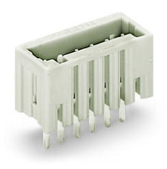
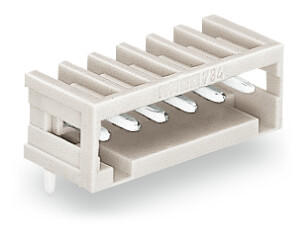

# Kicad-Wago-733

Kicad footprint for all 733 Horizontal and vertical socket. 
2.50 mm space from pins.

Tension de référence UL (Use Group B) = 150V

Courant de référence UL (Use Group B) = 4A

pinrange = 2, 3, 4, 5, 6, 7, 8, 9, 10, 12

